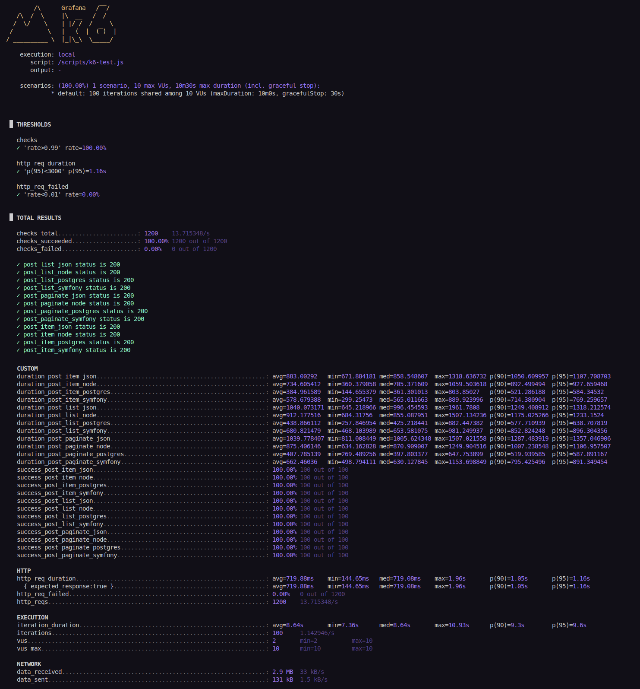

# Post API

> Create API entrypoints via different techniques.

## Benchmark

> [!NOTE]
> The part with the REST module has not been measured

I used [`k6`](https://github.com/grafana/k6) for testing performance.

:exclamation: Spoiler alert: **Postgres win** !

